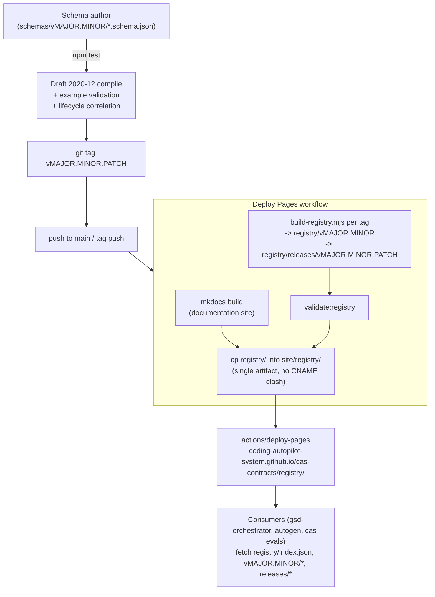

# Architecture

## Schema versioning + Pages registry publishing pipeline

<!-- codex:generate-image prompt="A printing-press pipeline: a schema document enters a validation gate, gets stamped with a version tag, then travels down a single conveyor belt that merges with a documentation-site stream before both are printed onto one large publication board reading REGISTRY; several small robot consumers below reach up and pull dated copies off the board; isometric, enterprise blue/graphite palette" style="isometric, enterprise, clean" replaces="mermaid-above" -->

## Publishing pipeline detail

`.github/workflows/pages.yml` is the **sole owner** of the GitHub Pages deployment — it builds
the mkdocs documentation site and the schema registry into one artifact so a docs push and a
schema release tag can never clobber each other on the single Pages origin. It runs on pushes
to `main`/`master` and on `v[0-9]+.[0-9]+.[0-9]+` tags. For each existing release tag it
archives `schemas/vMAJOR.MINOR/` at that tag, runs `scripts/build-registry.mjs` to produce
`registry/vMAJOR.MINOR` (stable, receives compatible patches) and
`registry/releases/vMAJOR.MINOR.PATCH` (immutable) trees, validates the assembled registry,
strips any `CNAME` (the registry is a Pages sub-path, not its own origin), and deploys via
`actions/deploy-pages`.

## Schema identity vs. distribution — currently in transition

`docs/DISTRIBUTION.md` already states the accurate contract: schema `$id` values reserve the
canonical namespace `https://schemas.coding-autopilot.dev/`, but that domain is not currently
resolvable, so **the GitHub Pages registry is the authoritative, resolvable distribution
endpoint today**. PR #18 (`fix(registry): rewrite schema $id to the resolvable Pages registry
URL`) is rewriting all 22 schemas' `$id` values to match this reality directly; it is open and
not yet merged — see [Decisions](./Decisions.md).

## Lifecycle contract

Every record carries `correlationId`, `promptId`, `runId`, structured `actor`, RFC 3339
`timestamp`, explicit `schemaVersion`, and W3C `traceparent`/`tracestate`, so an
`EvaluationResult` can be traced back through `VerificationResult`, `ArtifactManifest`, and
`RunEvent[]` to the originating `PromptEnvelope`.

<!-- docs-verified: 991c3606b148ab42134e505f4cf110afb8cb8e6b 2026-07-08 -->
